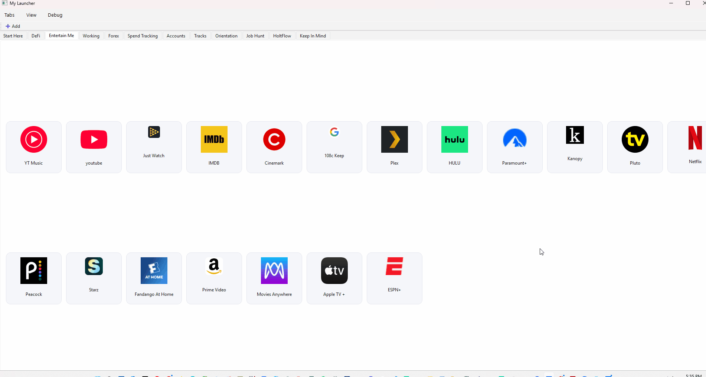
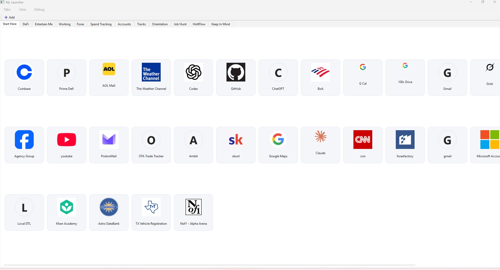

# DesktopTileLauncher

A lightweight Windows desktop launcher for quickly opening frequently-used apps, folders, and links — built as a sandbox for GenAI-assisted development + release discipline.


## Quick demo

<p align="center">
  <a href="https://github.com/108thecitizen/DesktopTileLauncher/releases/latest">
    
    </a>
</p>


## Screenshot

<p align="center">
    
</p>


[⬇️ Download the latest release](https://github.com/108thecitizen/DesktopTileLauncher/releases/latest)
[](https://github.com/108thecitizen/DesktopTileLauncher/actions/workflows/build.yml)
[](https://github.com/108thecitizen/DesktopTileLauncher/actions/workflows/release-tag.yml)

## Install

### WinGet (recommended)

```powershell
winget install --id 108thecitizen.DesktopTileLauncher -e
```

### Upgrade

```powershell
winget upgrade --id 108thecitizen.DesktopTileLauncher -e
```

### Uninstall

```powershell
winget uninstall --id 108thecitizen.DesktopTileLauncher -e
```


## Why this exists / what I learned

- Built to reduce daily friction: a lightweight Windows desktop launcher for quickly opening frequently-used apps, folders, and links.
- Used as a sandbox for AI-assisted development and agent workflows — iterating with Codex/ChatGPT/Claude and capturing “how to work on this repo” conventions in `AGENTS.md`.
- Reinforced “ship means stable”: small diffs, PR-friendly iteration, and automated checks so changes stay predictable as the project evolves.
- Reinforced “ship means safe” with GitHub Actions (tests + lint/typecheck), CodeQL, Dependabot, and tag-based releases.
- Practiced release discipline: tag-driven releases via GitHub Actions, plus a documented path toward signed binaries so end-user downloads can be trusted.
- Biggest takeaway: AI can accelerate iteration, but automation + clarity (tests/CI + explicit conventions) are the real guardrails.

## Code signing policy

Free code signing provided by SignPath.io, certificate by SignPath Foundation.

**Status & activation**  
As of 2025‑09‑05, released binaries are **not yet signed**. We plan to begin signing starting with release tag **v0.7.0** (and all tags thereafter). This section documents how signed releases will be produced and how you can verify them.

**Scope (what we sign)**  
We sign Windows desktop artifacts intended for end users:
- the main executable `DesktopTileLauncher-<version>.exe` published on the GitHub Releases page.
- for onedir builds, the executable(s) inside the folder; the `.zip` is a packaging container and is not Authenticode-signed. Verify the zip via checksums.

Intermediate CI artifacts may remain unsigned unless explicitly marked. Source code tarballs generated by GitHub are not signed.

**Provenance & build process**  
Releases are built from Git tags in this repository via GitHub Actions. We stamp version info from the tag (ProductVersion/FileVersion) and embed standard metadata (ProductName: “DesktopTileLauncher”). Signing occurs in CI after the final EXE is produced and **before** checksums are computed and published.

**Signing method**  
We use Authenticode with an RFC‑3161 timestamp so signatures remain valid after certificate expiry. The signing certificate is held by SignPath Foundation and used only for approved builds of this project.

**Roles & approvals**  
Authors/Committers: 108thecitizen  
Review/Approval for release signing: 108thecitizen  
External pull requests are reviewed before merge; only tagged builds from `main` are submitted for release signing.

**Privacy**  
DesktopTileLauncher does not collect telemetry. Network access is limited to user-initiated actions: opening a tile URL in your browser, adding or editing a URL tile may fetch a site icon through Google's favicon service, and completing URL entry while adding a new tile may make a best-effort request to that destination page to suggest the static page title. Explicitly refreshing selected tiles also attempts to contact each selected destination directly for a title and, when a host/domain can be derived, attempts to send that host/domain to Google's favicon service. The title lookup contacts the destination directly, requests only the top-level document, follows normal redirects, uses the response only when it is HTML/XHTML, executes no JavaScript, loads no subresources, sends no browser cookies or saved credentials, and fails silently. Full URLs, query strings, domains, tile names, retrieved titles, icon paths, and page content are not written to refresh diagnostics; only aggregate counts and result categories are recorded. The favicon lookup may make a third-party network request and may send the tile's domain/host to the favicon service. See [Debugging & Crash Reports](#debugging--crash-reports) for local log locations.

**Uninstall**  
Delete the application folder. Optionally remove per‑user logs/config in the directories listed in the README.

**Verification (how to check a signed release)**  
1) **Windows UI:** Right‑click the EXE → *Properties* → *Digital Signatures* tab.  
2) **PowerShell:** 
```powershell 
Get-AuthenticodeSignature .\DesktopTileLauncher-<version>.exe | Format-List
```
3) **SignTool (if installed):** 
```powershell 
signtool verify /pa /v .\DesktopTileLauncher-<version>.exe
```
4) **Checksum:** Compare against SHA256SUMS.txt published with the release:
```powershell 
Get-FileHash .\DesktopTileLauncher-<version>.exe -Algorithm SHA256
```

**Security & incident response**  
If we ever discover a compromised artifact or certificate, we will (a) revoke the affected release, (b) publish a GitHub Security Advisory with details and mitigation steps, and (c) rotate credentials and re‑issue a fixed build. Please report vulnerabilities privately via GitHub’s “Report a vulnerability” link.

Last updated: 2025‑09‑05

## License

Licensed under the Apache License, Version 2.0. See [LICENSE](./LICENSE) for details.  
Prior releases were MIT; the text is preserved in [LICENSE-MIT](./LICENSE-MIT).  
SPDX-License-Identifier: Apache-2.0

## Usage

### Configuration versions and recovery

DesktopTileLauncher reads at most 4 MiB of `config.json` for normal UTF-8 and
JSON parsing. Production persists the explicit identity-only schema version 1:
one Workspace, stable Workspace and Tab UUIDs, ID-based Tile membership, and the
existing flat Tile and launcher settings. Legacy configuration without
`schema_version` is version 0 and migrates transactionally through the registered
pure v0-to-v1 step. Migration creates exactly one `Default Workspace`; the
launcher title is preserved independently as `application.title`.

An explicit `schema_version` of 0 is invalid. A malformed version value or any
unsupported newer version, including the deferred full-graph version 2, receives
fixed **Exit**-only handling before legacy construction, normalization, or
saving. Invalid current version 1 and migration failures also use fixed
Exit-only handling. These version and migration cases never offer Preserve and
Reset.

The existing recovery choices remain unchanged for the established corrupt or
unreadable configuration categories. Startup offers exactly **Exit** or
**Preserve and Reset**. Exit is the safe default and does not change the
configuration or create a recovery copy.

Preserve and Reset first streams the original bytes into a private per-user
recovery directory beside, but not inside, the launcher icon directory. The
copy is independently verified byte-for-byte before the normal first-run
configuration is installed atomically. A reset is not attempted when copying,
verification, or the final source-change check fails. Verified recovery copies
are never overwritten or deleted automatically.

The Qt-free migration harness runs the pure deterministic v0-to-v1 step and is
ready for future consecutive registered steps. It validates the source before
preservation; a source-validation rejection creates no recovery artifact and
performs no write. When at least one step will run, the harness preserves and
independently verifies one exact recovery copy before the first step, validates
every detached intermediate and target document, and writes deterministic
UTF-8 JSON through a guarded atomic replacement. Candidate JSON preserves
non-ASCII text, sorts keys, uses two-space indentation and LF line endings,
rejects non-finite numbers, and has no trailing newline. The harness reverifies
both the source and recovery copy immediately before replacement, then reloads
and validates the installed candidate.

After replacement, the harness must successfully reload the exact candidate
bytes before treating the installed file as transaction-owned. Retention and
rollback occur only when that exact installed candidate is first proven and its
post-write target validation then fails. With ownership still proven, the
harness retains the failed candidate privately, reverifies the permanent
recovery artifact, restores its exact original bytes atomically, and verifies
the rollback.

A reload failure or exact-byte mismatch leaves ownership unproven, and a later
live-file change revokes ownership. These cases receive fixed Exit-only,
fail-closed handling. The harness performs no retention or rollback over an
unproven live path, so it does not overwrite possibly external bytes. A rollback
that cannot be completed or verified also fails closed. Published recovery
copies and failed candidates are private, never overwritten, and never deleted
automatically.

A valid current version 1 file loads directly without a startup normalization
write and never passes through repair-oriented legacy normalization. Workspace
and Tab IDs are not regenerated while loading, saving, or restarting. Actual
user mutations persist one complete strictly validated version 1 document
through the shared atomic-write path.

Migration recovery is not journaled. A process interruption after an atomic
candidate replacement but before post-write verification or rollback can leave
the complete candidate installed. On the next launch, DesktopTileLauncher
classifies and validates that live file normally; it does not guess which
recovery artifact to restore or automatically select one.

### Add tiles

- Use the **Add** button on the toolbar.
- Right-click whitespace within a tab and choose **Add Tile…**.

### Import URL lists

Choose **Import URLs…** on the toolbar or from a tab's whitespace menu to add
several tiles at once. Paste one URL per line, or load a UTF-8 text file, select
the destination tab, and choose **Review URLs**. The preview keeps every nonblank
source row visible so you can edit tile names and decide whether to include valid
duplicates. Invalid rows cannot be selected. Ready URLs are selected by default;
duplicates already in the destination or earlier in the batch are not.

The import review is entirely offline: it does not visit the URLs, retrieve page
titles or favicons, or send telemetry. Names are derived locally from the URL
path or host, and the existing generated letter icon is displayed without a
favicon lookup. Imported tiles use the default browser and open in a new tab.
Tiles are appended in source order. Hidden destination tabs are labeled in the
selector and remain hidden after import.
The launcher saves the complete batch atomically; if saving fails, no tiles are
added and the reviewed list remains available for another attempt. Import accepts
HTTP and HTTPS URLs only and limits a review to 500 nonblank rows and 1 MiB of
UTF-8 text.

### Refresh tile names and icons

Open the tab you want to work in and choose **Select tiles**. Click individual
tiles to select a subset, or choose **Select all** to select every tile in the
active tab. Persistent check indicators and selected styling show the current
selection, and the selection controls display its count. **Clear selection**
keeps selection mode open with no tiles selected; **Done** exits selection mode.
Switching tabs also clears the selection and exits selection mode.

With at least one tile selected, choose **Refresh names and icons**. Before any
lookup starts, the launcher shows a confirmation with the selected tile count
and warns that successfully retrieved names and icons replace existing custom
values. The safe default is to decline. Declining leaves the selection intact
and performs no lookup, file write, model change, or configuration save.

After confirmation, the launcher uses each selected tile's current URL to look
up the page title and favicon independently. A retrieved title replaces that
tile's name, and a retrieved favicon replaces its icon. If either individual
lookup fails, that existing field is retained exactly; failure of one lookup
does not prevent the other result from being used. Selection mode prevents URL
launches, context-menu changes, and tile dragging while selection mode is active.
When at least one field changes and staging preparation succeeds, the launcher
attempts one atomic save of a detached configuration. It swaps that configuration
into the live model and rebuilds the UI only after the save succeeds. A no-change
result performs no configuration save. Icon staging and configuration persistence
remain separate filesystem operations.

This explicit refresh is a network action: it attempts to contact each selected
destination directly for the best-effort page-title request and, when a
host/domain can be derived, attempts to send that host/domain to Google's
favicon service. Refresh diagnostics contain aggregate
counts and result categories only—not URLs, domains, names, retrieved titles,
icon paths, page content, or exception details that could expose those values.
The separate **Import URLs** review remains entirely offline as described above.

On Windows, selecting Google Chrome for a tile (or leaving the browser as
Default when Chrome is the system default) reveals a **Chrome profile**
dropdown. The list is populated from Chrome's local profile cache and includes
entries like `Default`, `Profile 1`, or names from signed-in Google accounts.
Choosing a profile pins the tile to that persona; select **None** to use
Chrome's last-used profile.

Each tile also provides an **Open in** option:

* **New tab in existing window** *(default)*
* **New browser window**

For Chromium browsers (Chrome/Edge), a new window adds the `--new-window`
switch. Firefox uses `--new-tab` or `--new-window`. If the tile targets the
system's default browser, Python's `webbrowser.open` is used with `new=2` for a
tab or `new=1` for a window. Safari and other unknown browsers fall back to
this behavior and may not differentiate between tabs and windows.

On Windows when the chosen browser is Chrome (either explicitly or because it's
the system default), the launcher invokes Chrome's command-line interface to
ensure "New browser window" always opens a separate top-level window.

Existing configurations that lack this setting are automatically migrated and
default to opening URLs in a new tab.

### Auto-fit window

The **View → Auto-fit Mode** submenu controls how the launcher resizes itself:

- **Always** – recompute and resize on every move or display change.
- **On startup** – fit once at launch (default), then allow manual resizing.
- **Off** – never auto-resize; the window remembers its size and position.

Choose **View → Fit to Display Now** for a one-off fit regardless of the
current mode.

## Debugging & Crash Reports

DesktopTileLauncher writes JSON logs to a rotating `debug.log` in a per-user
directory:

* **Windows:** `%LOCALAPPDATA%/DesktopTileLauncher/`
* **macOS:** `~/Library/Logs/DesktopTileLauncher/`
* **Linux:** `$XDG_STATE_HOME/DesktopTileLauncher/` or
  `~/.local/state/DesktopTileLauncher/`

Aside from user-initiated URL opens and optional favicon lookups described
above, adding a URL tile may contact the destination page directly to suggest a
static page title. Confirmed refreshes also attempt to contact each selected
destination for a title and, when a host/domain can be derived, attempt to send
that host/domain to Google's favicon service. Title lookup requests only the
top-level document, follows normal
redirects, uses the response only when it is HTML/XHTML, executes no JavaScript,
loads no subresources, sends no browser cookies or saved credentials, and fails
silently. Refresh diagnostics record aggregate counts and result categories
only—not URLs, query strings, domains, tile names, retrieved titles, icon paths,
page content, or sensitive exception details. Bulk URL import performs none of
these lookups and records only aggregate, categorical diagnostics—not URLs,
tile names, pasted input, or source file paths. The application does not send
logs or crash data over the network. When something goes wrong, use the *Create
Crash Bundle* button on the crash dialog to zip the log files and a `crash.json`
snapshot of runtime context. Attach this bundle when filing a GitHub issue.

## Running unit tests offline (Codex / air‑gapped)

We vendor Linux wheels under `vendor/wheelhouse-linux/` (PySide6 wheels are split into `*.whl.part-*` to stay under GitHub’s 100 MB limit).

**One-liner:**
```bash
bash tools/offline_bootstrap.sh
# or:
make test_unit_offline
